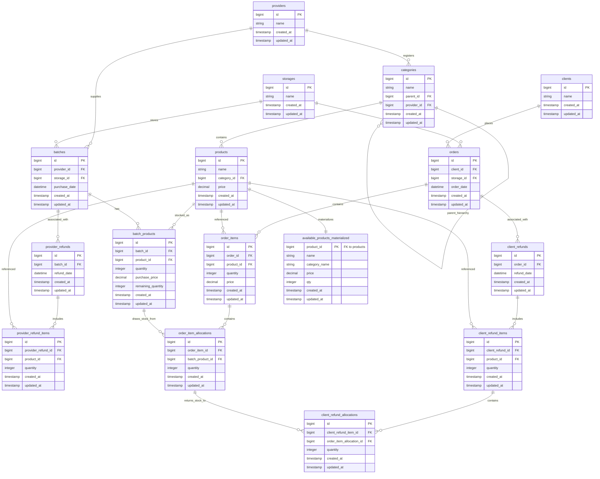

# Test task (Laravel Backend)

A performant, SOLID-compliant warehouse and inventory management system built with Laravel.

---

## 🚀 Getting Started

### Prerequisites
- Docker and Docker Compose

### 1. Build and Start the Environment
Run Docker Compose in the project root:
```bash
docker compose up -d
```
This starts:
- **`laravel_app`**: App container exposed on port `8000`.
- **`laravel_db`**: MySQL 8.0 container database exposed on port `3306`.
- **`laravel_adminer`**: Database manager exposed on port `8080`.

### 2. Setup the Environment File
Copy the example environment configuration:
```bash
cp .env.example .env
```
Generate the application key inside the container:
```bash
docker compose exec app php artisan key:generate
```

### 3. Run Database Migrations and Seeders
Initialize the tables, triggers, and default seeds:
```bash
docker compose exec app php artisan migrate:fresh --seed
```
This seeds the database with:
- Default Providers
- Default Categories
- Default Products (with pre-defined prices)
- Default Storages
- Default Clients

### 4. Run the Test Suite
Ensure that all features and business constraints function perfectly:
```bash
docker compose exec app php artisan test
```

---

## 📊 Entity-Relationship (ER) Diagram

Below is the database schema layout including tables, columns, keys, and their relationships:



---

## ⚙️ Core Business Rules & Constraints

1. **Client Chooses Storage**: When creating an order, a client must specify a `storage_id`. Product stock is allocated *strictly* from batches located in that chosen storage.
2. **FIFO (First-In, First-Out) Stock Allocation**: Stocks are allocated chronologically based on the provider's `purchase_date` of the batch.
3. **Selling Price Check (Order Creation)**: Order validation guarantees that the product's selling price is strictly **higher** than the provider's purchase price of any allocated batch product. If the purchase price of an allocated batch is equal to or higher than the selling price, the request fails.
4. **Purchase Price Check (Batch Creation)**: Creating a new batch fails if the provider's purchase price for any product is not strictly **lower** than the product's current selling price.
5. **Refund Returns to Active Storage**: A client refund routes returned stock to an active storage (either selected in the refund request or defaulting to the order's storage). If no batch exists in the target storage for that product, a new batch is initialized under the client's return to active storage.
6. **Real-Time Materialized View**: The `available_products_materialized` table pre-calculates the stock quantities, category names, and prices for available products in $O(1)$ read complexity. The synchronization is handled entirely by native database triggers on insert, update, and delete actions on `products`, `batch_products`, and `categories`.

---

## 🏗️ Architecture & SOLID Design Patterns

This backend has been refactored from a monolithic controller/service into a decoupled, clean architecture adhering to **SOLID principles**:

1. **Single Responsibility Principle (SRP)**:
   - Separate, focused API controllers manage different endpoints.
   - Form Requests handle request validation, keeping controller methods clean.
   - Separate services (`PurchaseService`, `OrderService`, `InventoryReportService`) encapsulate distinct business workflows.
2. **Open/Closed Principle (OCP)**:
   - Business rules and behaviors are built around extendable interfaces. For example, repositories and services can be swapped out without altering controller actions.
3. **Liskov Substitution Principle (LSP)**:
   - Models and repository implementations strictly adhere to their contracts and Eloquent standards.
4. **Interface Segregation Principle (ISP)**:
   - Dedicated repository interfaces ([ProductRepositoryInterface](./app/Repositories/Contracts/ProductRepositoryInterface.php), [BatchRepositoryInterface](./app/Repositories/Contracts/BatchRepositoryInterface.php), [OrderRepositoryInterface](./app/Repositories/Contracts/OrderRepositoryInterface.php), etc.) partition database interaction methods into small, logical clusters.
5. **Dependency Inversion Principle (DIP)**:
   - Controllers and services depend strictly on Repository Interfaces rather than concrete Eloquent database models, enabling mockable units for testability.

---

## 🛠️ Database Setup & Trigger Synchronization

To support both lightning-fast execution in local testing using SQLite (`:memory:`) and production-grade functionality using MySQL, database triggers are dynamically loaded inside the migration file [2026_06_19_000004_create_available_products_materialized_table.php](./database/migrations/2026_06_19_000004_create_available_products_materialized_table.php):

- **MySQL triggers** handle native trigger scripts using `INSERT ... ON DUPLICATE KEY UPDATE` and `NOW()`.
- **SQLite triggers** utilize standard SQLite trigger operations using `ON CONFLICT(product_id) DO UPDATE SET` and `datetime('now')`.

---

## 🔌 API Documentation Summary

An interactive API documentation powered by **Scramble** is available at the route `/docs/api` (e.g., [http://localhost:8000/docs/api](http://localhost:8000/docs/api) when running the application locally).

### 1. Catalog & Inventory
- `GET /api/available-products` - Returns a list of all products with remaining stock, category names, and selling prices (read directly from the materialized view).

### 2. Provider Purchase (Inbound Stock)
- `POST /api/purchase` - Creates a new batch of stock from a provider into a designated storage.
  - *Constraint*: Fails if any purchase price $\ge$ product selling price.

### 3. Client Orders (Outbound Stock)
- `POST /api/orders` - Places a client order from a designated storage. Allocates stock via FIFO.
  - *Constraint*: Fails if any purchase price in the allocated batches $\ge$ product selling price.

### 4. Provider Refunds
- `POST /api/provider-refunds` - Returns stock to the provider from a specific batch.

### 5. Client Refunds
- `POST /api/refunds` - Handles client refunds. Restores stock to an active storage (input `storage_id` or order's `storage_id`).

### 6. Reports
- `GET /api/reports/remaining-quantities` - Analyzes remaining inventory quantities relative to a specific date.
- `GET /api/reports/batch-profits` - Calculates gross profits realized per batch.
